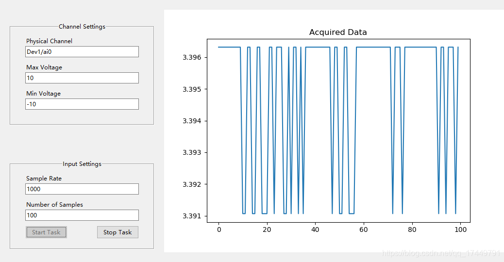

## 实验室管理软件（laboratory data info management-LabThings）
该项目项目对标bassetti-lims和jBEAM，然后根据客户的需求，做一个自己的实验室管理软件。是做一个实验数据管理软件，这种软件目前国内还没有做的好的，国外有一两个还不错。LabThings 允许您轻松地将现有的仪器控制代码转换为完整记录的标准化 Web API，并具有自动发现和自动后台任务线程

### jBEAM测试数据分析和管理系统包含的功能模块
```
jBEAM™: 基于Java的测试数据分析软件，它可以处理各种格式和来源的数据，如视频、音频、图像、传感器等。jBEAM™可以创建多种图表和报告，如曲线、直方图、散点图、表格等。jBEAM™还可以进行数据处理和转换，如滤波、插值、傅里叶变换等。
MaDaM™: 数据存储、搜索和组织利用软件，它可以将数据保存在一个集中的数据库中，方便用户检索和共享。MaDaM™可以管理数据的属性和元数据，如名称、日期、位置、标签等。MaDaM™还可以与其他信息系统集成，如ERP、EDM等。
jBEAMCluster: 多文件并行计算控制软件，它可以将大量的数据文件分配到多个计算节点上，实现高效的并行计算。jBEAMCluster可以根据用户的需求和资源情况，动态地调整计算节点的数量和负载。
MDFS: 测量数据分布式文件系统软件，它可以将数据文件存储在多个物理位置上，实现数据的冗余和容错。MDFS可以保证数据的安全性和完整性，避免数据的丢失和损坏。
EnCom : 企业通信协议软件，它可以实现不同平台和设备之间的数据交换和同步。EnCom可以支持多种通信方式，如TCP/IP、FTP、HTTP等。
```

### 测试py库文件
```
普遍需求:
* 构建标准测试和非标准测试库，存储测试参数和标准操作流程
* 预设实验的成本，持续时间和关联设备、人员
* 在库中根据不同标准对实验分类（实验类型、平均价格，持续
时长…）
* 与排程以及设备、人员库相关联

解决方案:
* 根据测试库确定实验的可行性
* 可配置化的测试库，测试描述可以配置任何种类的信息（类型，
成本，周期等）
* 此模块将和设备、人员库关联，同时关联到排程模块
```

### 设备管理
```
普遍需求:
* 每台设备都有详细且独立的参考文档和信息
* 储存设备的标准操作流程，图片，担保
* 关联设备信息到测试库
* 确保设备使用信息的可追溯性
解决方案:
* 定制化的设备库结构，对信息类型无限制
* 在制定实验计划的时候，关联设备到对应实验
* 关联设备负责人
```
### 耗材与库存管理
```
普遍需求
* 管理样件库存
* 建立一个潜在供应商数据库（价格，数量，参考资料…）
* 关联测试的消耗品和对应的库存管理
* 追踪消耗品库存及其仓储位置库存紧张时进行提醒
* 管理与耗材相关的数据表
* 管理消耗品的安全条例并落实到特定的工作流程中
解决方案:
* 在TEEXMA® 中建立消耗品的专用数据库
* 关联消耗品至设备库、测试库
* 消耗品供应商信息库
* 多站点储存的管理
* 根据实验计划自动更新库存
* 到期或库存紧张的提醒
```
### 数据处理和报告生成
##### 设备接入数据
```
普遍需求:
• 读取、管理来自测试设备的数据，无需二次输入
• 数据处理
• 保存原始数据文件
• 尽快访问并使用测试结果
解决方案:
• 可用于许多测试机器的标准连接器
• 专业开发新接口（API，记录的Web服务）
• 数据导入功能可以定时定期
• 可处理所有文件类型（文本，CSV，XML，Excel等）
• 快速便捷的输入设置
```
##### 定义测试数据模板
```
普遍需求:
• 根据测试类型定义数据模版
• 定义不同类型数据结果：列表，数字数据，布尔值等
• 数据输入标准化管理
• 简洁的测试结果输入界面
解决方案:
• 测试结果数据管理模块
• 显示和技术人员或实验室有关的测试
• 使用平板电脑输入结果

```

##### 实验报告生成
```
普遍需求:
• 提取和管理测试报告，以Word，Excel和PDF文件格
式
• 让技术人员有更多时间专注于高价值劳动
• 创建与以下运行项目关联的报告模板的存储库：应用
程序，样本，测试等
• 根据客户创建不同的模板
解决方案:
• 通过可配置的提取功能，可以实现从已有的模板直接生成报告
• 模版库（根据不同客户需求分类的模版库）
• 多样化模版管理和使用
• 根据需要提取部分或完整的报告
• 管理员模式客户可自行增减模版
```

## 总结

#### 1 ）工作流程管理
##### 怎样规划工作流程、哪些地方做流程控制节点。通过可配置的工作流模块，管理实验室的所有活动和流程，从创建分析请求到生成完整的报告。通过交互式的仪表盘，发送个性化的电子邮件，管理资源和权限，集成设备和干预，实时计算负载，提高实验室的生产力和质量。

#### 2 ）测试库
##### 维护测试项目的方式包括测试方法、参数、规范、计算公式等。还可以连接到设备，自动或手动输入数据，计算显著值，比较规范，生成曲线和统计等方式，增加测试结果的价值。

#### 3 ）设备管理
##### 集成设备和干预，实现设备的自动识别、校准、维护、故障排除等功能。跟踪设备的使用情况、状态、效率、寿命等指标，优化设备的管理和利用。

#### 3 ）耗材与库存管理
##### 管理耗材的类型、数量、位置、有效期等，也可以设置耗材的最低库存量、预警提醒、自动补货等方式，避免耗材的浪费和缺乏。

#### 4 ）报告生成
##### 通过模板定制、报告审批和版本控制、集成电子签名、集成报告到EDM等方式，编辑符合法规和质量标准的报告。可以选择通过文本搜索和多条件筛选、数据比较和统计、曲线叠加、本地导出到桌面工具等方式，利用数据进行分析和可视化。

#### 5 ）文件管理系统
##### 与EDM系统集成，实现文件的存储、检索、共享和保护。还可以将文件与测试项目关联，实现文件的完整性和可追溯性。


#### 11.3需求讨论
```

点完了之后呢，就是。像电模块呢，其实是一开始是我们要按照要求去把那些线什么做连接去相应的。家具测试家具，然后呢，后面就是电路板，同一型号的电路板就批量就在上面测试。哦。那平。这个操作是很类似的，但是这个步骤也是就是。嗯，按照模板就是主动


有一部分设备，对，这个是以设备为主


就是那个测试。测试的那个流程。应该得看一下那个王思婷，她当时前面做的一些代码的一些梳理和积累了。这个不只是这个文档的工作。是个大。还有代码的框架那一块，之前是问过一些那个。然后当对对对，当时就做到这儿，然后我们当时应该是已经派on实现驱动那个N的那个电度板，然后再用在这个基础上，然后再用robot framework来写这个自动化测试这一块，应应该当时的进度是这样吧，蒋工王思婷跟你交流的也当时是这样的。对对，我因为当时候我见过那个王雪婷跟顾老师一块儿做过这个相应的一些梳理工作，对吧，让顾老师去把他围了一下这些代码框架对吧，嗯。然后其实主要就是其实。其实这个这个基础的管理是跟那个生产差不太多，然后其实我就想的是看看我们的这个设备，相应的这个操作这一块，能够做一个比较基础通用的一个框架，后面我们好进行测操作这些这方。K，然后他干完测试


应该啊，没有交给这个电路版测试软件，这个取说明书吧，我记得。嗯，他好像当时应该没有负责这一块吧，当时不是那个什么。什么化化化工啊，发妈100化化工在整体那那个谁那个那个那那个于文会就是他那个现在就类似于我们给东方电器做的那个就就就类似于那那个东西。对


明角的功能特别这个项目里面是两部分，一部分。嗯，这个咱们咱们的。你妈现在我们现在做这个系统。就因为我们说电板测试啊，还有那些电路板筛选啊，做水循环呀，然后还有我们去找X光这些测试，这些检测的话，实际上就是跟我们的生产工艺整个过程相。他就是在我们生产之前，相当于我们的来检测。然后后期呢，我们还要做一个水循环测试。那我们这两套系统呢，是。整合起来。这的事情


我大概这个这个系统，你看这个架构，其实他设计上可能和现在的这个，现在这个智慧车间。采用的是一个那个单体的这样一个应用的，然后这架构。网关就接入到我们的系统里头，这这两个不用不用。好的，然后就是两个独立的系统，然后到云云上以后是看起来。然后也不说一个系统吧，看看起来就是可以可以那个同一入口来访问对吧。嗯，好好的好的。在之前设计的一些思路上还是有。呃呃呃呃说一下王淑婷。当时他们的那。那个就是用那个Python Python找用Python来写的那个板卡，那个驱动，然后然后在这个基础上，然后再用robot framwork，然后再做那个文化。

我我没我没怎么看他的代码，但是但是那个我知道他这个是，他这个是做了一个技术调研，算是一个预言。因为也是我们以前没有。把这个跑起来，然后去。这个这个相当于把这个技术路线给他明白了啊，我认为可能是应该这个算是这样一个进度，那个说是直接拿到这个项目上用，可能还不行。行，那我们下一步可能就是说啊，他那个技术路线证明可行了之后的话，那下一步就是证明。怎么样去怎么样去做。就先以一个电路板的测试流程为基础。我们。是吧，然后。讨论进展下去。我们要不按照这个说法


那个全套的流程不是化工那都有吗？化工行，那我我我跟化工再对一下吧，因为我这个事儿，我这周我没有找化工来


这个啊，就是那个，当时我记得那个整个实验室的设备应该有有好多是吧，那本只是其中一个。所有的应该都是还是在这个平台里那个全部管理起来


这肯定电协。他的重点在。他们可能针对每一个设备的这部分的接口都得重新做一些需求


有问题，所以说那个。在家里把那些有些设备手册先熟悉一下，让他然后自己先把。对呀。就是那个我们有一有一个软件在。就是那个架构费，然后跟他这个网页之间，就是他他这个管理系统是用网，网络打开以后，他就是有一些任务下发是吧，就过来。对，我那个就是我们的那个任务可能要做一下领取嘛，然后领取先扫一扫我们的那个工。去找到我们的这个测试的这个工单，然后关联到我们的那个工装啊，那个家具。测试的那个，还有那个测试，测试流程文件，这些都要想化下来。最后那个展示在操作操作公司那面的那个界面，应该应该是那个公艺自动化那个软件是吧，就。还是怎么样去取几号家具呀，怎么去安装给你确认


把前期的被确认完之后，后面就扫码去。扫码，然后点开是来自母拼测试。然后后台数据呢，就保存下来，生成报告上传


不过也可以不需要特别复杂。他只是。操作人员能够完成我们这个测试。我们的电模块的功能测试是。是可以长时间跑，然后可能软件界面软件这上面会稍微有点不一样，到时候我们看看再再用其他什么项目来做这个事


来了，你把每每一个实验都都在上面能找到我们怎么？与挖掘使用的。保证我们的基本的测试能做能做做到做到位是。因为我们有这些数据了，后面我们遇到什么问题，我们要去再再回过头来再跟你挖掘。对那些那个其他就不是我们开发主控的，像像舒适啊，那些设备，他本身是他们自己也有个程序在那儿运行界面的是吧。他那个我就叔叔，我找聊完了嘛，他是有。烟接口我刚刚发出来，去去去把他的那个什么那些控制曲线呀，发给他控制他启停，读他的状态，他的报告啊，那就将来他那个就在后台在那儿运行，我们这边就给他通讯发送就行了，是吧，就空了，对对没错，跟他拿一个网线连上就行


像将来的话，我们的这个这个就是因为之前我们做那些测试，那个喷分箱啊，还有我们的这个测试台数据相互之间都是有孤立的。然后这样的话，我们对整个的那些测试什么东西就能够串联起来，我就一个设备，我就把它全控制完了。好，你要

然后还有就是那个到时候。那时候我们外面是有个液氮罐。一些安全的监控，到时候我们还可以讨论一下这个方案，嗯。好的


到时候如果你把这些要点都记一下，这个每一部分都要重新再讨论需求，把这个整理出来以后，我们就可以开发了，嗯，好的好的，我我再理一遍。然后然后我最好是我们这边能做一个，就是像之前一样，连一个办卡看一下就多一个，那个没关系，我们现在都可以，我们群里有的。昨天小红也发了一一天晚上啊，不是发了一批那个什么那个对我们自己就有，就东方电信那个就跟他类似的啊，你现在做的那个子华软件，就是给那个东方电信那些其实也是。FCU做做测试嘛，那也是电路板啊，那个功能就是这个线路


因为我们这个实际上我们比较关注的就是我们这个每一块电路板啊，我们测试的匹配，因为平常测试吧，你对人员。要求他们去点很多东西，他有时候保不齐真的是就点错对是对，我们就想通过这种条形码或者二维码，这种我们提前编辑好这种关联，我们确实不错的概率就能降低好。测试的完整性，完美性能做的好一点，对啊，类似于一个实验室这样的一个标准化流程了，是吧，就那些人来怎么培训，就按照这个做一遍是吧。


对，然后就现在我们在我们的仪器设备都在新疆做实验，那真的就是文慧现在参与了我们那个智慧车间的那个暖气。


然后他们的维保装配，就把东西给装错了，就直接就就就就还没下去就出故障了，这好概念，对对对，这个就是就是流程啊，就是流程管理好了就跟着讲。到了对那那个弄的，我们现在就是抓紧时间要把这些生产工艺啊，这个流程给弄好，这减少将来很多不变的麻烦，现在产量还没那么大，那产量再大一点，那真的是我们就完蛋了。是，这部分那个你说之前有一些可以参考的那个是是国外的是吧，有一些软件做的比较好是吗？我就是我们现在在用的呀，就是让那个顾老师接手的那个啊，你那个。


那个其实就就挺好对吧，你认为就是他他他一他那个工人下一步下一步然后就完成了一项测试，然后数据就能上传上来，就这样一个达到这样一个效果是吧。对，我们其实就是其实要求也没有那么高，就是确实是没有没有没有，我觉得金老师做肯定应该超稳吧，我们想再再找找有没有全球更好一点的，我们再看看啊，我们现在。在怀柔就是把所有国外最好的东西都买了啊，都规划一套啊，我们来再再整理一套，将来要创业了，什么时候什么时候我有空，我也我也跟您一块儿去怀柔看看吧。那那个怀柔那块没有没有那个就是只是个保密单位，他没有可看的，他那实验室要分布在昌平啊，张家口啊，不同的地方啊，那边只是个研发的那个。


整个的叫实验平台的规划，那个很大啊，对那个到时候可以内部我们也可以交流一下，就是整个那个那个实验平台，我们我们。


```
#### 组会汇报

已经开始了课题研究，那你进行工作进展汇报就可以了。把你最近做了什么，有什么进展，得到数据的有效分析，研究过程遇到的问题、拟采用的解决办法，以及接下来的研究计划，这些内容做一个完善的汇报。关于汇报的内容一定要注意分寸，不要不懂装懂，有问题要积极向导师或师兄师姐请教、交流。

为什么自动化测试框架中优先用 Pytest而不是 Robot Framework？

框架 ( Framework ) 是整个或部分系统的可重用设计，框架是用来解决代码的组织及运行控制问题的。
在我们编写自动化脚本的时候，经常需要读取配置文件，读取数据文件，发送请求，记录日志，连接并对比数据库数据。每个脚本里都重写一遍各种方法不仅工作量大而且易错。所以我们需要把公共的方法提取出来，封装成单独的模块，放到公用方法包里。另外配置文件，数据文件，日志等我们也需要分类存到不同的文件夹下。这种对公共方法的封装及对脚本及配置文件怎么组织的设计就叫做框架。
同时，一般框架除了完成对代码及配置文件的组织之外还要提供运行的控制功能。比如批量执行，分模块执行，生成报告，异常处理等等。
总结为以下 3 点：

封装公共方法
代码及配置文件的组织
执行控制
什么是测试框架？
一个完整的测试脚本（用例）一般包含以下几个步骤：

环境准备或检查
执行业务操作
断言结果
清理环境
而测试框架一般还要完成用例加载，批量执行，异常控制，结果输出等功能。基础的测试框架一般只提供执行控制方面的功能。
测试框架应具有的特点

易用性：编写用例，执行用例，生成报告及定位问题方便；
健壮性：稳定，比如 timeout 机制等；
扩展性：插件；
灵活性：用例组织或执行的灵活性，Fixture 功能（不同范围的 setUp 和 tearDown）等；
定制性：二次开发方便；


Pytest 与 Robot Framework 对比

Pytest 框架特性
Pytest 是一款强大的 Python 测试工具，它具有易于上手，功能强大，第三方插件丰富，效率高，可扩展性好，兼容性强等特点，实际上，越来越多的项目开始放弃 Unittest 和 Nose 以及 Robot Framework ，转而使用 Pytest，比如 Mozilla 和 Dropbox. 因为 Pytest 可以提供更丰富功能，包括 assert 重写，第三方插件，以及其他测试工具无法比拟的 fixture 模型。
Pytest 可以自动找到测试用例执行，并汇报测试结果。它有丰富的基础库，可以大幅度提高用户编写测试用例的效率。它具备非常强的可扩展性，用户可以自己编写插件，或者安装第三方插件。Pytest 可以很方便地与其他工具一起使用，比如持续集成、web 自动化测试等。
Pytest 也具有 Robot Framework 所闻名的验收测试能力。Pytest 最好的特性之一是，它提供了测试用例的详细失败信息，使开发者可以快速准确地改正问题。它兼容最新版本的 Python，还兼容 unittest、doctest 和 nose，开箱即用。Pytest 还有各种可用插件来给现有测试技术和测试用例增加更多功能和多样性。事实上，在其活跃社区中有 300 多个可用的插件。该平台设计用于编写更简单，错误率更小的代码。你可以将 Pytest 与诸如 Selenium 和 Splinter 之类的图形用户界面一起使用，来使测试工作更轻松.


Pytest 优于其他测试框架的地方：
简单测试可以很简单的编写
复杂测试也可以很简单编写
简单灵活，容易上手
支持参数化
能够支持简单的单元测试和复杂的功能测试，还可以用来做 selenium/appnium 等自动化测试、接口自动化测试（Pytest+requests）
Pytest 具有很多第三方插件，并且可以自定义扩展，比较好用的如 Pytest-selenium（集成 selenium）、Pytest-allure-adaptor（生成漂亮的 allure 报告）、Pytest-rerunfailures（失败 case 重复执行）、Pytest-xdist（多 CPU 分发分布式执行）等
测试用例的 skip 和 xfail 处理
可以很好的和 jenkins 集成
测试代码可读性强
易于上手
断言失败仅使用原生关键字 assert，而不是 self.assertEqual()，或者 self.assertLessThan()
Pytest 可以运行 unittest 和 nose 编写的测试用例
不依赖特定的 Python 版本，Python2 和 Python3 都可以使用最新版本
正在快速壮大的社区开发和维护

Robot Framework 框架（简称 RF）
优点

关键字驱动，自定义用户关键字。
支持测试日志和报告生成。
支持系统关键字开发，可扩展性好。
支持数据库操作。
缺点

测试用例写起来并不简洁。
需要掌握特定语法，学习成本高
只支持 Python2，不支持 Python3，容易导致测试团队 Python 版本不统一
界面反应速度慢，经常卡死
导入测试库有时会异常
对于测试团队限制过多，不利于结合具体业务定制功能
问题调试困难
输出的日志结构复杂，多为英文，不容易看懂
维护困难，超过 2000 条用例就是噩梦
接口测试，rf 一般是顺序执行的，但在接口测试中需要并发测试，这种测试需要加入写入的并发关键字

下面是一个使用rfbrowser的rf简单测试：
*** Settings ***
Library    Browser

//全局变量
*** Variables ***
${BROWSER}    chromium
${HEADLESS}    false

// 首先构造关键字
*** Test Cases ***
Create Quote for Car
Open Insurance Application
Enter Vehicle Data for Automobile
Enter Insurant Data
Enter Product Data
Select Price Option
BuiltIn.Sleep  3
Send Quote
End Test

*** Keywords ***
Open Insurance Application
New Browser    browser=${BROWSER}    headless=${HEADLESS}
New Context    locale=en-GB
New Page    http://sampleapp.tricentis.com/

Enter Vehicle Data for Automobile
Click    div.main-navigation >> "Automobile"
# 刷新页面
Browser.Reload
# 继续执行其他操作
Select Options By    id=make    text    Audi
Fill Text    id=engineperformance    110
Fill Text    id=dateofmanufacture    06/12/1980
Select Options By    id=numberofseats    text    5
Select Options By    id=fuel    text    Petrol
Fill Text    id=listprice    30000
Fill Text    id=licenseplatenumber    DMK1234
Fill Text    id=annualmileage   10000
Click    section[style="display: block;"] >> text=Next »

Enter Insurant Data
[Arguments]    ${firstname}=Max    ${lastname}=Mustermann
Fill Text    id=firstname    Max
Fill Text    id=lastname    Mustermann
Fill Text    id=birthdate    01/31/1980
Check Checkbox    *css=label >> id=gendermale
Fill Text    id=streetaddress    Test Street
Select Options By    id=country    text    Germany
Fill Text    id=zipcode    40123
Fill Text    id=city    Essen
Select Options By    id=occupation    text    Employee
Click    text=Cliff Diving
Click    section[style="display: block;"] >> text=Next »

Enter Product Data
Fill Text    id=startdate    12/16/2023
Select Options By    id=insurancesum    text    7.000.000,00
Select Options By    id=meritrating    text    Bonus 1
Select Options By    id=damageinsurance    text    No Coverage
Check Checkbox    *css=label >> id=EuroProtection
Select Options By    id=courtesycar    text    Yes
Click    section[style="display: block;"] >> text=Next »

Select Price Option
[Arguments]    ${price_option}=Silver
Click    *css=label >> css=[value=${price_option}]
Click    section[style="display: block;"] >> text=Next »

Send Quote
# 休息30秒才重新进入网页，因为网页有些更改
#BuiltIn.Sleep 30
Fill Text    "E-Mail" >> .. >> input    dogechat@163.com
Fill Text    "Phone" >> .. >> input    0049201123456
Fill Text    "Username" >> .. >> input    max.mustermann
Fill Text    "Password" >> .. >> input    SecretPassword123!
Fill Text    "Confirm Password" >> .. >> input    SecretPassword123!
Fill Text    "Comments" >> .. >> textarea    Some comments
${promise}=     Promise To    Wait For Response     matcher=https://sampleapp.tricentis.com/101/tcpdf/pdfs/quote.php    timeout=20
Click    "« Send »"
${body}=    Wait For    ${promise}
Log    ${body}[status]
Log    ${body}[body]
Wait For Elements State    "Sending e-mail success!"
Click    "OK"

End Test
Close Context
Close Browser

### 关于Kubernetes

#### 服务发现+负载均衡
```
kubernetes和springcloud有本质区别
1 springcloud的服务发现和负载均衡只管理java程序。而kubernetes不限制支持的应用程序，不提供任何源代码，也不局限于任何一门编程语言。
```
#### 自动部署和回滚
```

```
#### 自我修复

### Kubernetes组件
#### Master组件
```

```
#### Node组件
```
kubelet
1 每一个节点都运行一个代理(Agent)，保证每个容器container都运行在kubelet抽取的pod中（听音乐买的肯定是ipod而不是直接买音乐），pod里面可以有多个容器。
    1.1 kuberletes使用pod来组织一组容器，一个kubelet可以控制多个pod
    1.2 一个pod中的所有容器共享同一网络
    1.3 container不是kuberletes的最小单元，而是pod
    1.4 container可以理解成一个docker
2 负责每一个容器的生命周期，同时也负责容器挂载目录CSI的管理和网络CNI管理（（Container Network Interface）和 CSI（Container Storage Interface））
    2.1 通过kube-proxy管理CNI和负载均衡

service
1 定义一组pod的访问策略：可以挑出一组pod进行组合形成一个业务群
2 pod的负载均衡：提供一个或者多个pod的稳定访问地址

label
标签，用于区分不同pod，以及资源的查询和筛选

namespace
命名空间：我们接触的所有命名空间作用都是为了进行逻辑隔离
```

#### vitual box && vagrant 安装地址
```
版本：virtualbox/6.0.10/  vagrant/2.2.5/
    https://download.virtualbox.org/virtualbox/6.0.10/
    https://releases.hashicorp.com/vagrant/2.2.5/
```
下载安装完成之后，进入k8s文件夹cmd，使用vagrant up 命令拉取操作系统镜像
进入root权限：su root
修改密码访问：vi /etc/ssh/sshd_config
将passwordAutheni no 修改成 yes
esc :wq 保存
重启服务: service sshd restart
使用xshell连接192.168.56.100-102
右键对所有会话进行输入

检查网络：
* 1 ip route show 显示默认网卡，eth0
* 2 ip addr 查看eth0，发现都是同一个ip地址，原因是网络连接选择了‘网络地址转换（NAT）’，这个方法是通过端口映射得到的网络，因此ip都是一样的
* 3 要改变ip，我们使用 “NAT网络”，注意在高级选项中修改一次mac地址
* 4 还有一点要注意，我们在修改NAT网络之前要通过全局设定中的网络新建一个NAT网络

关闭防火墙、SEliunx安全策略（Security-Enhanced Linux）：
systemctl stop firewalld
systemctl disable firewalld
cat /etc/selinux/config 这句命令可以查看这个config的内容,具体修改还是下面这句话：
sed -i 's/enforcing/disabled/' /etc/selinux/config
解释这句话：sed 是一个文本处理工具，用于在文本文件中查找、替换和编辑文本内容。-i 在原始文件中进行直接编辑。's/enforcing/disabled/' 是一个 sed 命令，它的作用是在文件中查找第一次出现的 "enforcing" 并将其替换为 "disabled"。/etc/selinux/config 是要编辑的目标文件的路径，这是SELinux的配置文件。
setenforce 0

关闭swap内存交换：
swapoff -a（这句话只是暂时应用,通过cat /etc/fstab查看，虚拟机开关就重置了，因此需要下面一句话）
sed -ri 's/.*swap.*/#&/' /etc/fstab

关键，添加主机名字与IP对应关系：(可以先用hostname查看主机名，如果不是则需要修改hostname)
vi /etc/hosts
10.0.2.15 k8s-node1
10.0.2.4 k8s-node2
10.0.2.5 k8s-node3
（可以使用xshell的发送键盘输入的所有会话  批量修改）

将桥接的IPv4流量传递到iptables的链（为了统计流量指标）覆盖名为 /etc/sysctl.d/k8s.conf 的文件，并且 << EOF 表示后续的文本输入将持续到遇到 EOF 为止：
cat > /etc/sysctl.d/k8s.conf << EOF
> net.bridge.bridge-nf-call-ip6tables = 1
> net.bridge.bridge-nf-call-iptables = 1
> EOF

重新加载系统中的所有Sysctl配置文件，通常位于 /etc/sysctl.conf 和 /etc/sysctl.d/ 目录中:
sysctl --system

##### 网络准备完毕，安装kubernetes相关docker,kubelet,kubectl,kubeadm

首先把之前的docker删除：
sudo yum remove docker \
docker-client \
docker-client-latest \
docker-common \
docker-latest \
docker-latest-logrotate \
docker-logrotate \
docker-engine      以及其他的，这里就不写了

安装docker前置依赖：
sudo yum install -y yum-utils \
device-mapper-persistent-data \
lvm2

安装docker前还需要更新docker的拉取仓库目录：
yum-config-manager \
--add-repo \
https://download.docker.com/linux/centos/docker-ce.repo  自己找

安装docker和docker-cli:
sudo yum install -y docker-ce docker-ce-di containerd.io

配置docker拉取镜像的加速：
mkdir -p /etc/docker
tee /etc/docker/daemon.json <<-'EOF' { "registry-mirrors": ["https://82m9ar63.mirror.aliyuncs.com"]
}
EOF
systemctl daemon-reload
systemctl restart docker

配置docker开机自启动
systemctl enable docker

修改kubernetes yum源：
$ cat > /etc/yum.repos.d/kubernetes.repo << EOF
[kubernetes]
name=Kubernetes
baseurl=https://mirrors.aliyun.com/kubernetes/yum/repos/kubernetes-el7-x86_64
enabled=1
gpgcheck=0
repo_gpgcheck=0
gpgkey=https://mirrors.aliyun.com/kubernetes/yum/doc/yum-key.gpg
https://mirrors.aliyun.com/kubernetes/yum/doc/rpm-package-key.gpg
EOF

指定版本安装kube相关：
yum list|grep kube
yum install -y kubelet-1.17.3 kubeadm-1.17.3 kubectl-1.17.3

之后设置kubelet开机启动(可以通过systemctl status kubelet查看状态，其实是没有启动成功的:一直是activating状态)：
systemctl enable kubelet
systemctl start kubelet


首先下载好镜像：为k8s文件夹下的master_images.sh设置rwx权限：chmod 700 master_images.sh
然后运行sh
如果出现错误：Cannot connect to the Docker daemon at unix:///var/run/docker.sock. Is the docker daemon running
就是docker未启动：systemctl status docker => dead
需要启动并设置自动启动


master 节点初始化（也需要拉取很多镜像，从k8s.gcr.io网站，国内无法访问，因此需要修改镜像拉取仓库地址）：
kubeadm init \
--apiserver-advertise-address=10.0.2.15 \
--image-repository registry.cn-hangzhou.aliyuncs.com/google_containers \
--kubernetes-version v1.17.3 \
--service-cidr=10.96.0.0/16 \
--pod-network-cidr=10.244.0.0/16

然后等待，得到以下结果：
Your Kubernetes control-plane has initialized successfully!

To start using your cluster, you need to run the following as a regular user:

mkdir -p $HOME/.kube
sudo cp -i /etc/kubernetes/admin.conf $HOME/.kube/config
sudo chown $(id -u):$(id -g) $HOME/.kube/config

You should now deploy a pod network to the cluster.
Run "kubectl apply -f [podnetwork].yaml" with one of the options listed at:
https://kubernetes.io/docs/concepts/cluster-administration/addons/
（Flannel 是一个可以用于 Kubernetes 的 overlay 网络提供者。）

Then you can join any number of worker nodes by running the following on each as root:
（用以下命令把其他节点加入集群）

kubeadm join 10.0.2.15:6443 --token 47oiow.uuzn0idx2wc8q526 \
--discovery-token-ca-cert-hash sha256:e75d9e37b7f87ea6ec787d99427bff77f9e8ab0d9df7c8ef9b77f904b345a72c
（
注意，在节点join的时候使用这个令牌，但是这个令牌只有2个小时的持续时间：按照以下命令生成新的：
kubeadm token create --print-join-command
kubeadm token create --ttl 0 --print-join-command

    得到：kubeadm join 10.0.2.15:6443 --token hnk85o.sruq0n6r24zcbh08     --discovery-token-ca-cert-hash sha256:e75d9e37b7f87ea6ec787d99427bff77f9e8ab0d9df7c8ef9b77f904b345a72c

    解决很多问题
）

kubectl apply -f kube-flannel.yml

kubectl get pods --all-namespaces  得到pods的状态，但是其中有一个coredns是pending，不是running状态。如果CoreDNS Pod处于Pending状态，可能是由于缺少网络插件导致的。使用以下命令先删除，再重新通过网络地址安装kube-flannel.yml：
kubectl delete -f kube-flannel.yml
kubectl apply -f https://raw.githubusercontent.com/coreos/flannel/master/Documentation/kube-flannel.yml  但是访问不来，所以要先去网页下载这个文件再重新传到虚拟机里面

安装完集群之后，使用kubectl get nodes，显示master是ready了

#### 再次查看状态，可以得到全是running的pods，同时用systemctl status kubelet ，可以看到active状态。使用kubectl get nodes, 得到ready的master节点

这时候就可以部署其他节点：先确定master节点的ip，一定要对应。之后对其他机器使用下列命令
kubeadm join 10.0.2.15:6443 --token 8mgmlh.cgtgsp3samkvpksn \ --discovery-token-ca-cert-hash
sha256:3cf99aa2e6bfc114c5490a7c6dffcf200b670af21c5a662c299b6de606023f85

如果token不对，会出现很多奇怪的错误 一定保证token是新的，不能复制文档的token，2小时过期


#### 开始：操作kubernetes集群

在master节点操作
kubectl create deployment tomcat6 --image=tomact:6.0.53-jre8

然后可以通过kubectl get all 获取资源信息，但是这个指令不能看到pods具体部署在哪一个node节点，可以通过下列命令查看：kubectl get all -o wide
kube会自动操控这个节点的docker来 创建容器  docker images 可以查看镜像，docker ps 查看容器信息

创建了pods之后可以查看（需要查看默认pods:kubectl get pods --all-namespaces）：
kubectl get pods

现在模拟该部署的node节点宕机的情况：给该机器关机

在这时候用master节点使用命令查看信息，可以看到一个terminal的和一个creating的：
kubectl get pods -o wide

给机器开机，再查看pods信息，可以看到正在清除这个宕机机器的tomcat镜像，因为不能让两台机器重复部署

暴露部署：
kubectl expose deployment tomcat6 --port=80 --target-port=8080 --type=NodePort

查看部署的service:
kubectl get svc -o wide

动态扩容：scale: 命令用于扩展或缩小 Kubernetes 中的资源。--replicas=3: 确保在集群中运行指定部署的 3 个副本。
kubectl scale --replicas=3 deployment tomcat6

删除pods(由于pods创建的时候会分配成service，因此不能只删除pods，要删除deployment):
kubectl get all
kubectl delete deployment.app/.....

之后查看kubectl get all 只能看到暴露端口的service，但是pods是空的service也没用，所以要把service也删除了：
kubectl delete service/....

#### 以上信息是通过命令行kubectl创造pods的熟悉流程
还可以通过kubectl create deployment tomcat666 --image=6.0.53:jre8 -o wide --dry-run 来获取对应的创建yaml文件过程
也可以把yaml输出到新文件：
kubectl create deployment tomcat666 --image=tomcat:6.0.53-jre8 -o yaml > tomcat6.yaml
可以vi将该yaml文件的空内容删掉，就得到了一个pods模板
kubectl apply -f tomcat6.yaml

同理，暴露服务也可以用 --dry-run -o yaml  查看yaml， 这个yaml和deployment的不同是kind这一行

#### 需求语音
```

扫描那个产品下发的二维码得到 sn号 ，现在这个系统其实没有输入，本来按道理应该是做成两个页面。第一个页面就是我登录人员登录，第二个我才去选择这个订单二维码并且扫描，他这个只是做到一起了。你知道吗？那你这样的话，人员不是不用输密码了吗？对，但是我觉得这个是有问题的，可能他们也得调。就是人员，你不能输密码那那大家都可以随便，等我知道他的账户名就可以了嘛，那肯定，我觉得还是不行吧。然后这样我们就需要去同步，通过系统，就通过扫描这个产品的二维码去找，我要下的订单他那个配置文件是什么。需要进行一个数据同步，然后这样同步他这个要测试什么样的内容？然后我们之前做这个脉冲机器测试的时候就挺麻烦的嘛，需要打开打开很多软件，然后还要去人员去盯波形。然后这样的一个过程，你看现在其实大体上的流程都是一样，但是对于人员的这种要求就比较高了，又得会打开软件，又得会看模型，又得懂一些东西，懂一些流程，那就很麻烦嘛，还要懂EPU，还有各种其他东西。这个关于那个测试方面的那些设备什么的。很麻烦，所以说你通过这个，就是我们做了一个流程，前期可能稍微麻烦一些，然后期可以直接进行就是测试。我们要做的就是，其实就是那种说了，说的稍微不好听一点，其实就是傻瓜模式。就是人员只需要去点，下一步有一些异常呢，他就会挑一些异常就可以了。


然后就这样进入到自动测试了。这个是一个简单的一个测试的一个一个流程，然后给你以后给你演示一个稍微复杂。就是我们会有一些波形都是监测的，他那边出现异常是怎么处理的？出报告，直接就会出报告，就在一会儿就停了出报告。哦哦哦，出现错误就填报告不往下测试了。因为因为对，我们要做的就是对于测试人员就是要求会稍微低一些。就不要那么高的一个要求。

这个是我们打算新做的，我们打算新的那个项目做的软件就是把这个改造成傻瓜式的。一个是说。其实是这样，就是说这个只是一个样例我们要做成，比如说做成要去管，首先要做一个。管这个东西的软件，这是我们首先要做的，其实就是这些与这些设备之间的那些那些测试流程。你是要去做的，所以这只是一个样例，他只说这些流程就变成这样了，但是说要去怎么去管它，其实目前是没有这个。应该具体这个东西啊，对，只是说这是只是一个样例，我们大体上可以参考这样的一个流程啊，行，那我知道，然后我们看第二个项目的话，我们会提供两个这个电路板的测试台。也是类似，也是外观。嗯，我我具体的是测试什么项目呢？就是电路板测试，电路板测试，嗯，应该可以参考一下吗？就差不多，也是这么。可以参考一下吗？行，那我们就打开，然后另外我们不是还有两个软件吗？一个是。一个是管理软件，一个是本地的那个测试软件，本地的测试软件的话，需要把你这个设备给换成我们关联的那个软件吗。做那个软件，那应该应该，我了解应该就是说通过你们那个设备，然后去调整你们那个软件吧。不需要把这个设备修改了。哦哦，那这个设备后面要接入到我们的那个管理软件里面去吗？嗯，我没接到通知说这个设备，因为这个设备应该是属于这个脉冲器测试台的一个设备。没有听说要接到新的实验室管理软件里面。这个脉冲器测试台本身的软件已经挺好了

我们现在总共两个项目，一个就是这个脉冲器的相当于维保，维保，改善，改进的项目，第二个是我们新做，新做的实验室管理软件（接入苏试电路板测试仪器和X-RAY检测）的项目。这里面目前的那个大体的流程包括权限管理。包括这些数据的这个处理，其实类似很类似，然后你可以去参考一下我们目前都做了什么内容。你们现在这个测试能编写测试流程吗？能改吗？能改一些参数，能改只能改参数。那么像下一步或者说加一中间加一步啥的目前不行哎。然后。可以看到这个测试设备的一些状态。（对于这个维保项目）目前这个打开才能看到他那个测试的状态吗？他开始了，但是我们后面要调成为。就是离线状态，然后什么测试中，然后或者说是他这个等待测试这样的一个一个一个东西，不是说。我们这个现在目前的那个只有一个状态，就只有一个状态，而且他离线的话，他都不行。

刚才说的话，这个需要调整这个测试步骤的话不能通过这个来调整。对对，就是这个，这个软件其实不需要调整什么测试步骤什么的。但是我觉得可能咱们去做那个电路板测试，我觉得好像需要去调整测试步骤的，对对，那我知道了，就是这是。两套两套系统。然后我估计以后咱们去做这个，就是电路板测试，这方面可能也要，因为有一些设备嘛，然后可能要也要做成这样的一个数据看板形式。然后，然后可以看到我这个测试的一个状态，然后包括一些很基本的一些。就是功能，比如说备份啊，然后权限管理啊，然后还有那个备份的那个数据，然后去。回传回来，这些应该都是，应该都可以做，这个需要到时候我们在那个需求说明书里面详细的描述（因为不算定制化需求对接）。然后上面那个测试基本上就已经就完了。对，就基本上就已经完成了，然后给你看一些，当我去，然后会形成一个测试报告，然后测试报告呢？就会。也会保存到这个本地，然后也要考虑他的这个处于离线状态嘛，他离线状态他就要等到他这个通过之后才能去回传。回传回来，然后我们可以通过这个位置应该就可以看到他的这个报告。就通过这个系统管理可以看到他这个这个报告，然后他的比如说我们也要把这些报告进行一个收集，后期有可能进行一些。分析包括就是一些测试的这些数据分析什么的，产生异常分析啊，这样也是一样的嘛。然后包括我们之前做的这个就是物料这个使用记录什么的，可能对于这个，咱们那个测试软件可能也要记录下来。这个测试设备进行了什么样的一个测试，然后什么时间进行的，这样可能都要进行一个统计，还有测试人员。我都要进行一个一个数据的一个统计。现在的形式就是发工单，下发工单然后直接就拿到二维码扫描就可以进行测试了。然后我们也可以参考，我们那个就做，咱们做物料包那个吗，就是我可以能够看到我这个，通过仪器上面可以看到我这个工单有什么，有什么样的工作？想改进的是然后我不需要去用二维码，我不需要就是只能从那台机器上面才能看到来让工人去那边去领工单，可能该进为下发式的可能会更方便一些。

#### 第二部分

电路板测试应该也要首先进行测试仪器同步的这些检查，先进行这样一些仪器位置标定这种常规的检查，然后才能进行这个测试工作

我们会有，于老师，王老师应该看过，就是我们会有一些波形的监测，然后会也会，就是之后会产生一个数据报告，然后把这个数据报告会回传到系统里面。然后这边会有一些，比如说电路板可能也是涉及到我要测试什么样的东西，我觉得电路板测试可能还要设计一个东西，就是说我现在把测试可能要有一些测试流程。比如说我先要进行什么样的一个测试，后进行那样的测试，然后通过流程再去管这些个一个一个设备。然后把设计设备的回传到这里，就是这是我的一个一个一个设想啊，对，本来就是，跟讲的沟通也差不多。大体上就是这个意思。对，因为之前也见过这个，突然感觉好像不太对。我们主要就是这个傻瓜式的，一步一步的对我们。我们未来做测试的话，也是尽量减少人员的，一个一个思考，尽量通过这个系统，然后就软件去控制它。然后。去看看那边的一个，看他那边有

苏式这个机器就是给电路板提供的环境比如高低温，震动。哦哦，这个机器现在就是做高低温，震动。对，我们就就提供把这个电路需要。这个机器一般的高峰是150。零下20。极限能做高峰180，零下60。


我们控制机器的电脑就是在这边吧，你怎么控制他的电脑？来看，上午做了一个周期的高温150测试嘛得到了这个曲线。电路板我们就提供电路板在线测试，苏式机器那边不是还有一套东西？苏式机器那边接了电路板，接了线，我现在这个电脑的软件在就控制这个箱子呢。你这个是控制这个机箱的，控制电路板需要的环境，比如抖动啊，震动啊，高温多少低温多少呀。这个测试有那个运行时长的流程吗？就比如高温要测试多久，我们一般就是这一套，常规是两个小时，也有需要的话。做八个小时，根据电路板需要。我们最长做过八个小时，连着做。这个是出的报告，对，它自动生成报告。高温低温，150+20的环境。零下60的曲线报告图。就是，做的是。极限了。这个也是报告从110温度到170温度。看一下他的一个报告。一点一点的就加了温度。

需要。就是。嗯，这这弄的这个实际。就是。对，就是我们常做就这个东西。我给你看看那个软件。咱们那个软件。就就就就就。也是我们那个。这个人是咱们自己开发的吗？还是说那个，这个不是，不是这个牌子的？他们他们开发不是咱们开发的，是苏式自带的软件。测试流程已经（被苏式自己在出厂的时候）编好了在这个目录里面，一点开软件就能做这个测试。编好了吗？编好的测试任务。要开始测试只需要点击，然后连接他就这机器最后点击运行，他就可以开始运行了。那我还可以再加一些测试步骤吗，可以啊，现在你可以加。不过软件的参数都是定死了的，出厂就是这个参数。这个 PAD这个写着，这个计划，咱们这边的这个车，多少温度，多少时间啊，多少震动啊。主要就编这个测试计划比如高温多少？低温多少？震动多长时间。

？幅度是吧？对这种幅度的速度，振动时间，对对对。对对。然后包括这个高低温，我先，我先，我在多长时间能够到达什么样的一个温度，然后。然后呢，我就是那个到什么时间，然后温度又回来，他参数参数这种厂家过来给我们调了。对，运行一段时间，感觉这个曲线控制不太好了，他们就过来给调一下。过来讲，这两个孩子的东西不一样，这俩孩子参数，参数这些地址还不一样。然后咱们电路板就会放到这个里面，把这个会放到这个里面，然后会那些测试线什么的。那些测试线什么？那些东西会会会会拉出来？这个，这个，这个也会出来，这个电路板嘛，然后出来之后呢，那我就进行这边进行测试。这个电路板我们可以就是现在，目前可能用各种各样的软件去进行测试，后来就想做。嗯，测试就做到那个流程里面，那我们就一一点，要不要去干什么，测试了，一点下一步，下一步，对工作人员就去点下一步就行了。我们在里面去编好这些流程，要进行什么测试。包括一些安全。好的。这个这个不用动，这都死了。这时的。因为主要我们这边的人，然后我在想的是能不能把这个软件和咱们那个电路板测试进行一个结合。通过咱们的系统进行一个流程的一个设定，比如说。我这个电路板，我在什么样的一个环境里面进行什么样的一个电路板测试电路板？不过线，然后去点，里面都要。外面会有一个电脑软件。在进行那个现在，目前是通过各种各样的软件进行电脑测试，可能未来我们要进行一个流程。的，比如说。
#### 第三部分


。你们那个测试用用的不同的测试用不同的软件。对呀，白的不想了解这个软件，有的软件。不一样的。信号是什么啊？那没有，那个就是看头的。几度探头有温度的，有正正重量级的探头。九个探头总有一些。一旦这方面，咱们那个就是管路吗？那个泄露什么？以前讲过，我说这电脑。直观能看见。就比如说我们可以做一个。比如说我要进行测试。首先要去，有摄像头吗？我上头一摄像头二摄像头三就假如说。那个这块，那我就流程的检查，第一个上头。直接打开这个上头，就是监测到那个上头了，他打开了看到这个位置，能看到是好的，能进行下一个上头，就是下一个位置的一个检测。然后这样一过来，就不用人人员去跑，跑起来去看一下，这时时能看见，如果一定要时时看这儿露不露，他其实露特别明显。哦，就是这个。大家聊嘛，我们一出来他就。在细化的。正常情况就是慢慢的，你要是漏的。嗯嗯嗯嗯。还有室外的。现在我在这里转了。这上面，上面，上面。这就是室外的。夜半监控了。那属于他，只需要监控就行是吧？对对，监控能看到漏不漏。一些安全，但是说。这个流程我觉得要要做到，咱们那个，那个，对对对。可能他只是一个。就是一般。你是不是测之前检查吗？


。是，他是这个测电路板之前的一个步骤是吧？对，就是我先检查，检查完之后我的这个。这之前应该不是车间，我不开这里没有，没有。就运行。过程中，使用过程中，这里。因为他要测两个两个小时，那个过程当中也要对的过程当中。那就是把它做到过程当中，你可以自己去写测试测试。我把这一步，检查这一步放在哪一步，但是随时都能随时监控这个问题了。那你要随时监控，那就不能坐在测试机。就是这句话中就是一步一步。对对对对对对，那那这个不是这里，放外面来，然后。比如说我做一个按钮，时时去看他，不一定，不一定时时去看他了，我觉得我想起什么时候，看看能不能。或者或者说就是那定时检测一下是吧？不一定是定时，我觉得可能是他你事实根据他的一个规律，就是说我什么样的情况会产生液氮，它就会蹦出来，那个弹出来就到你这块漏了。可能就不一定是人员去监督，我觉得可能都到这种程度了，就是说我他到底，他的业单到底是？会造成室温的一个，环境的一个一个骤降，或者说因为别的什么原因，他就会通过一些这个这种发射器会传音信号会传到这个里面，就告诉你这块漏了。因为他这个过程，我觉得都不一定是其他的。这个这个环境可能要是氧气。这就是他少了以后少浓度少了有他那会儿报警，但咱们的整个全敞开的，我觉得对，这就是他这个。我现在是不是也要做一个这种？我再换一个，比如说。我觉得可以给他做一个框。

。做一块，在框里面做一个传感器，我这个框里面的温度骤降，我在你那个，你那个。


那个透明的，那个是亚克力的什么的，你就弄个穿的，我看不见了。你这个拆装很方便，因为我这个这个地儿了，更换频率特别快，几个月就换。以前都是这样包出来的，你看都都是拿着跟我们的包子，他一路我就把他。都可以换地儿啊啊啊，以前都包包了一漏的。现在这两台的使用频率多，但它坏的坏的频率也比较快。两个月到三个月吧，这这这这这，能到零下多少度？196度。你说那块就单，做一个流程，然后呢，你这个软件订单，然后这个。就相当配置文件这样发过来，最好不能进行一个自动测试，这样就可以了吗？我测试完之后呢？高速测试，对，这个高温筛选测试，然后就是我们还要去做一个什么，明天做一个那个哈萨克。电路板上面的模块的一个检验就是通过 x 光，然后可以看到那个模块它的焊接有没有什么问题什么的？这几种测试反正都是用不同的软件去操作啊，对，还有不同的设备。软件不是，到时候功能上面应该，软件应该都应该都是一样的，那我测，我测测，测试到场的那个，入场测试，还有测试后面那个其实。这个软件，但是你要做这个筛选，还有这个电脑版，那个模块筛选，还有这个这种这种筛选功能筛选其实。这两个是不一样的，用的设备是不一样的。不如我带他们去看看这个。先照片以后直接通过。我借口上传到那个平台上去，然后在平台上大家就这个意思。

。或者是通过报告，报告对，通过报告，然后有一些。重点位置的一些一些内容应该。有些指导，我要去检查这些位置，有些电话吧。那这些呃会生成一个报告吗？目前还是手动写报告。他们能有机器可以自动出报告吗？这么高端吗？这个这个。就是通过这个里面，因为这个板子就像这个器件一样，我的不同的对比度。比方说我这个对不住。我就可以看到这个点，但是这个点我就看不了了，我就要去调它的对比度。因为不同的期间他的情况不一样，所以。你说的那个自动的。的确是，有可能是。不太好实现，但是还得靠人，但是说就是说只要需要简单的一个截图，然后。就是他们简单截图就行，然后也不需要去写那个报告，包括我们其实都差不多了，然后就生成出来一个。一个报告，然后会转到咱们系统里面来看，其实就可以很好实现了，因为有的点，比方说你要不去转？就算这个点，他看到角度。我可能就看不到那个地方。你要去转旋转，然后我要去找到我最合适的那个点去转转。你不是在这个设备上再增加点功能？嗯，对，然后看能不能就是。我的那个系统能不能？联系到一起，然后做一个电子版的一个整体的一个。测试测试系统包括功能测试。

。包括他的一个。去去管控他？比如电脑版目前到什么样的一个进度了，对吧？测试到哪步了？然后呢，一个人员是谁呀？现在目前。但是怎么处理，然后比如报告，像这种，就是说你们现在需要去手动去填写这个报告嘛？可能我们想就是更方便，更方便一些，就是说我只需要去截几张图。然后直接就回传到那个里面来，直接就生成那个报告，然后就直接上传上去，进行一个文件，文档的一个储存，其实对于你来说，其实文档的储存也是很麻烦的，我每天要要。我会觉得有很多汗，我照还照不过来呢，我还吐的什么文档啊。那就是这种能够自动去上传到归类他的文件夹里面来，然后进行一个储存，然后方便我们。过去的一个分析，然后出现什么问题，我们能查到他是哪个，哪天查到这个电路板，然后怎么样能查到这些这些这些过程，对对对。包括我之后一个经常出现问题的点，我们就可以找供应商了嘛，对吧？那他为什么这么？是吧，放在我们就是这些数据的一个处理。那有一些关键的点是怎么去，去，去，去，对，这个就可能就再需要一个工艺的一个编辑吧，就是说，我。我这个电脑，其实它的气垫在每个位置都是固定的嘛，那我就在一个电路板上就，我就要求就是说。哪些期间联系啊，需要去重点看一下就可以了，有关系都要重点看一下这些图的时候，这些图就。对对对对对对对对，但是说这个前面这个过程可能需要您配合，因为那些那些事件说需要去，我们重点去看可能我们可能。那也是不是没没有你那边那么专业吗？那我们可以，对对对。然后去，可能要是怎么去方便你们工作呀？这些我们可以去，我们再去，可以去考虑。就把板子拿在里面，能批量的最好，他自己照，我们还能玩会儿别的，那是最好的，哈哈哈哈，这个可能，这个设备可能都有。哈哈哈哈哈。好了，这个。诶。

。嗯。而且他那件还是有问题，是有问题。一般都是10万块20万块。一模一样的，然后我们不是一样的。所以我们还是现在还是保持在这种状态，对自己截图发，对自己截图发。我有意的会放上去。像这种有细渣的，这种的，是不是从你们这个系统里面就能操作，能识别出来？金属外来物应该不好，不好，不好，这个不好做。是不是？我有。我们这不是空间，这个你们那个系统。如果说过来的话，就放空间，不用，不用，不用，不用，不用，不用，不用，不用，不用，不用，那个线到其他地方去。然后你们如果想查看的话，就随便用个平板电脑或者电脑。那就是还是得有局域网，你们这边是不对？对对对对对，要有局域网，到时候我们会弄一个局域网。我现在就。多少个局域网？你们这有很多局域网，我猜想，因为麦子上了也是上的。对啊，然后你们这个再上一个局域网，我们那个，我们有可能跟卖公共的一个局域网。曼斯这边没有过啊，在那个南车间北车间都有，那那就把你这边给交了。这就是我得问一下他，他说理工都知道。这个是不是？不便宜。

。这里面是有放射源的吗？还是有那个？电动的。有高压也有，也有放射性的东西，还是 x 射线呢？用高压激发来支持这样的？对那那还好，不用。那个监控手续一大堆。应该是没有，是你们这个网上再弄一个是不是就需要他的系统文件了？应该是，就是你们测试的结果，然后上传到那个。数据系统里面去。这是用这台电脑上的，这台电脑用这台电脑上。对这个吗？对，所以他们不是说在跟这个厂家在谈那个向上开放空间。嗯，我们一般都是。那你继续拿装结构？自动上传。自动上传，那他这个。那你们这个测的时候是是人工测吗？我们测我们的后台。网上传，对对对对对对对，应该是这个，比如说我们那个，这个照完了以后，我们想要报告，我们就去那个。可以可以了，可以去那个网站，就是可以直接。你去看，也可以下载下来，都都可以。就按照我们那个模板出来，可以可以自己设置模板，对，所以等会我们过段时间这些需求的时候。你们需要把这个需求都提供给我们，然后我们来给你这个需求，然后来设计这个系统，设置完之后再给你们来确认。哦。您这边就跟那个理工这边去对接是吧？哦，对对对，就是到时候理工，但是我给你们。来对接这些，一个一个来对接这些，除了你们这好像还有其他部门吧，应该是。你说那我们这个金子一样的死机或相机了那种。

对，我们那个，比如说我们那个要死机，是不是中间会缺失一些数据？不会。不会，就跟那边的，那边的那个呃，那个汽车一样，他会做一个零件的缓存。然后就是你，你死机了，你断了吧，断了之后你恢复网络之后才会继续上。然后我们这机子经常坏。所以我们做的那个系统也主要是方，为了方便大家，不是说对，这个系统挺好的啊，不是，不是给大家增加的测量，而是减少。我们。那挺好的。你们大概跟李公司那边是什么时候开始？最近两个月。今年今年可以把设计方案，今年可能把设计方案。然后明年上半年。现在开始使用了。今年，今年我们把数学方案的需求，那可以，那挺好的。我们还要再看看板子吗？不用了，不用了。


```

#### Industrial Management 环境搭建(操作系统最好选择支持nodejs18.14以上的，而不是选择centos7.9)
1. Postgresql、pgadmin安装

环境要求：
x64, 8GB以上内存, 4核以上，100GB以上剩余空间, 可选访问公网(10MB/s以上网络带宽)

安装之后目录如下，包含了pgAdmin 4：


新建一个pgdata文件夹目录,之后开始安装：
cd pgsql/bin

pgdata的目录是F:\pgdata ,得到初始化数据库命令，设置数据存储位置，超级管理员账号:
initdb.exe -D F:\pgdata -E UTF8 --locale=C -U postgres


进入pgdata查看，新增了很多文件，-D F:\pgdata: 指定数据库集群的数据目录为 F:\pgdata。这是新数据库集群的根目录，所有 PostgreSQL 数据和配置文件都将存储在这个目录中。-E UTF8: 设置数据库集群的默认字符集编码为 UTF-8
--locale=C: 设置数据库集群的默认区域设置（locale）为 C。-U postgres: 指定初始化数据库集群时创建的超级用户的用户名为 postgres。

执行这个命令后，F:\pgdata 目录下将包含 PostgreSQL 数据库集群的各种文件和子目录，包括但不限于：
```
base/: 包含数据库的实际数据文件。
pg_xlog/: 包含事务日志文件。
pg_clog/: 包含事务控制日志文件。
pg_wal/: 包含 Write-Ahead Logging (WAL) 文件。
pg_tblspc/: 用于存储表空间的目录。
pg_twophase/: 包含两阶段提交的文件。
pg_stat/: 包含统计信息文件。
pg_log/: 包含日志文件。
postgresql.conf: PostgreSQL 的主配置文件。
pg_hba.conf: 数据库防火墙，用于控制身份验证的配置文件。
pg_ident.conf: 用于身份映射的配置文件。
```

将以下内容增加到postgresql.conf文件末尾：
```
listen_addresses = '0.0.0.0'
port = 1921
max_connections = 200
tcp_keepalives_idle = 60
tcp_keepalives_interval = 10
tcp_keepalives_count = 6
shared_buffers = 512MB
maintenance_work_mem = 64MB
dynamic_shared_memory_type = windows
vacuum_cost_delay = 0
bgwriter_delay = 10ms
bgwriter_lru_maxpages = 1000
bgwriter_lru_multiplier = 5.0
bgwriter_flush_after = 0
old_snapshot_threshold = -1
wal_level = minimal
max_wal_senders = 0  # 如果max_wal_senders大于0，需要设置wal_level至少为replica级别。 PG 10开始，max_wal_senders默认值为10，以前的版本默认为0。
synchronous_commit = off
full_page_writes = on
wal_buffers = 64MB
wal_writer_delay = 10ms
wal_writer_flush_after = 4MB
checkpoint_timeout = 35min
max_wal_size = 2GB
min_wal_size = 80MB
checkpoint_completion_target = 0.1
checkpoint_flush_after = 0
random_page_cost = 1.5
log_destination = 'csvlog'
logging_collector = on
log_directory = 'pg_log'
log_truncate_on_rotation = on
log_checkpoints = on
log_connections = on
log_disconnections = on
log_error_verbosity = verbose
log_temp_files = 8192
log_timezone = 'Asia/Hong_Kong'
autovacuum = on
log_autovacuum_min_duration = 0
autovacuum_naptime = 20s
autovacuum_vacuum_scale_factor = 0.05
autovacuum_freeze_max_age = 1500000000
autovacuum_multixact_freeze_max_age = 1600000000
autovacuum_vacuum_cost_delay = 0
vacuum_freeze_table_age = 1400000000
vacuum_multixact_freeze_table_age = 1500000000
datestyle = 'iso, mdy'
timezone = 'Asia/Hong_Kong'
lc_messages = 'C'
lc_monetary = 'C'
lc_numeric = 'C'
lc_time = 'C'
default_text_search_config = 'pg_catalog.english'
```

将以下内容添加到pg_hba.conf文件末尾，允许网络用户通过用户密码访问postgresql数据库：
```
host all all 0.0.0.0/0 md5
```

启动并配置开机自动启动postgresql数据库集群：
```
pg_ctl.exe start -D F:\pgdata

```

程序注意别关了，编写start_pg.bat开机自启动文件：

```
@echo off
cd "F:\pgsql\bin"   # 这里替换为你的 PostgreSQL 安装路径
pg_ctl.exe start -D F:\pgdata
```
关闭集群：pg_ctl.exe stop -m fast -D "F:\pgdata"
连接数据库：
```
psql -h 127.0.0.1 -p 1921 -U postgres postgres
```
更正 pg_hba.conf的追加命令host all all 0.0.0.0/0 md5  注释掉 否则说读不出来这个文件

端口号选择默认5432，因此连接命令变为   psql  -U postgres postgres

新增一个超级用户：
先输入 \dt

create role postgresql login superuser encrypted password "postgresql"

输入 \du+ 查看用户


草：django.db.utils.NotSupportedError: PostgreSQL 12 or later is required (found 9.602).

### 以上Industrial Management 环境搭建==在吹牛

#### IoT平台搭建
Industrial Management 环境搭建
#### 一、linux安装redis（5.0.10）
```
tar: 这是 Linux/Unix 系统上用于压缩和解压缩文件的命令。

-z: 表示使用 gzip 格式进行压缩/解压缩。
-x: 表示提取（解压缩）文件。
-v: 表示详细输出，显示正在处理的文件列表。
-f: 后面跟着的是要处理的文件的名称。
```
1 官网 https://redis.io/download
2 mkdir /root/redis, cd /root/redis , Redis 默认安装路径是/usr/local/bin
3 安装网络下载命令wget：yum install wget
2 wget http://download.redis.io/releases/redis-5.0.10.tar.gz
3 tar -zxf redis
4 由于redis是由C语言编写的，它的运行需要C环境，所以编译前需安装 gcc , yum install gcc-c++
5 编译安装：cd redis-5.0.10 ,  make && make install
6 将src文件夹下的redis-server脚本移动到bin目录：cp src/redis-server /bin    将redis.conf移动到etc文件夹：mv redis.conf /etc
7 修改redis.conf:
```
        #设置外部可连接redis服务
        protected-mode no
        #开启后台启动
        daemonize yes
        #bind 127.0.0.1
```

8 启动redis    /bin/redis-server /etc/redis.conf

#### 二、mysql 5.7
1 检查系统是否已经安装mysql: rpm -qa | grep mariadb, mysql  如果有就删除：yum remove mariadb-xxx
2 mkdir /opt/soft，cd /opt/soft, 将tar文件移动至这个文件夹，解压：tar -zxvf mysql-5.7.28-linux-glibc2.12-x86_64.tar.gz
3 mv mysql-5.7.28-linux-glibc2.12-x86_64 mysql-5.7.28
4 cd /usr/local , 添加环境变量命令: ln -s /opt/soft/mysql-5.7.28 mysql
5 添加mysql用户，修改mysql目录权限，并用此用户执行应用  (不，直接root用户)
```
useradd -s /bin/false -M mysql
cd /opt/soft
chown -R mysql:mysql mysql-5.7.28
```
6 yum install vim, vim /etc/my.conf 写入my.conf配置文件：
```
[mysqld]
# binlog 配置
log-bin=/usr/local/mysql/logs/mysql-bin.log
expire-logs-days=14
max-binlog-size=500M
server-id=1
# GENERAL
basedir=/usr/local/mysql
datadir=/usr/local/mysql/data
socket=/usr/local/mysql/mysql.sock
user=mysql
default-storage-engine=InnoDB
character-set-server=utf8
lower_case_table_names = 1
explicit_defaults_for_timestamp=true
[mysqld_safe]
log-error=/usr/local/mysql/mysql-error.log
pid-file=/usr/local/mysql/mysqld.pid
[client]
socket=/usr/local/mysql/mysql.sock
[mysql]
default-character-set=utf8
socket=/usr/local/mysql/mysql.sock
```
7 cd /opt/soft/mysql-5.7.28 ， 安装mysql
为了避免出错，先执行这几个命令：
错误：在my.cnf中指定的binlog配置文件的logs文件夹不存在  解决：mkdir /usr/local/mysql/logs  chown -R mysql:mysql /usr/local/mysql/logs
yum -y install autoconf
```
bin/mysqld --initialize --user=mysql --basedir=/usr/local/mysql --datadir=/usr/local/mysql/data
```
出现 A temporary password is generated for root@localhost: t6+K=sfTReg6，代表成功，保存一下临时密码

8 拷贝启动程序，将mysql的启动程序拷贝到/etc/init.d/目录下
9 启动mysql
service mysqld start

10 配置环境变量，编辑/etc/profile，方便在任何地方用mysql命令  vim /etc/profile
```
#mysql
export MYSQL_HOME=/usr/local/mysql
export PATH=$PATH:$MYSQL_HOME/bin
```
11 重新编译   source /etc/profile

12 登录mysql，修改密码 mysql -uroot -p
输入刚刚保存的临时密码

13 首次进入mysql需要修改密码：
```
alter user 'root'@'localhost' identified by '252525tyl';
flush privileges;
```

14 配置远程访问权限：
```
GRANT ALL PRIVILEGES ON *.* TO 'root'@'%' IDENTIFIED BY '252525tyl' ;
flush privileges;
```
#### 三、 jdk8
1 查看是否默认jdk
```
rpm -qa | grep java
rpm -qa | grep jdk
rpm -qa | grep gcj
```
2 创建目录 mkdir -p /usr/java/ && cd /usr/java/
3 解压 tar -zxvf jdk-8u241-linux-x64.tar.gz

3 配置环境变量：vi /etc/profile
```
# java8
export JAVA_HOME=/usr/java/jdk1.8.0_391  (注意版本号要对上自己下载的java包)
export PATH=$JAVA_HOME/bin:$PATH
```
4 重新编译   source /etc/profile， 验证安装 java -version

#### 四、 elasticsearch 7.4.2

1 下载 elasticsearch 和其分词器的压缩包，注意版本保持一致。
```
[root@localhost ~]# cd /usr/local/src/
[root@localhost src]# wget https://artifacts.elastic.co/downloads/elasticsearch/elasticsearch-7.4.2-linux-x86_64.tar.gz
[root@localhost src]# tar -zxf elasticsearch-7.4.2-linux-x86_64.tar.gz -C ../     这是 tar 命令的另一个选项，指定提取文件的目标目录。
[root@localhost src]# cd ../
    接下来在/usr/local 目录下创建一个名为 elasticsearch 的符号链接，该链接指向 /usr/local/elasticsearch-7.4.2/ 目录。这样做的好处之一是，通过使用符号链接，你可以轻松地更改 Elasticsearch 的版本如7.4.3或者7.4.4，而不必更改所有与 /usr/local/elasticsearch 相关的路径:
[root@localhost local]# ln -s /usr/local/elasticsearch-7.4.2/ /usr/local/elasticsearch
    这里环境变量和上面的两行不一样，这个 没有用%es_home%这种格式
[root@localhost local]# echo 'export PATH=/usr/local/elasticsearch/bin:$PATH' >>/etc/profile
[root@localhost local]# source /etc/profile
[root@localhost local]# mkdir -p elasticsearch/plugins/ik      递归的创建ik分词库，因为plugins文件夹不存在
[root@localhost local]# cd elasticsearch/plugins/ik
[root@localhost ik]# wget https://github.com/medcl/elasticsearch-analysis-ik/releases/download/v7.4.2/elasticsearch-analysis-ik-7.4.2.zip
[root@localhost ik]# unzip elasticsearch-analysis-ik-7.4.2.zip
[root@localhost ik]# rm elasticsearch-analysis-ik-7.4.2.zip
```

2  elasticsearch 默认禁止使用 root 启动。创建普通账户 es 并授权。
```
[root@es ik]# cd /usr/local/
[root@es local]# useradd es
[root@es local]# passwd es
[root@es local]# chown -R es elasticsearch*
```

3 切换为 es 普通用户修改配置并启动 elasticsearch。
```
[root@es local]# su - es
[es@es ~]$ cd /usr/local/elasticsearch/config/
[es@es config]$ cp elasticsearch.yml{,.bak}  复制elasticsearch.yml文件，并将副本命名为elasticsearch.yml.bak。
[es@es config]$ vim elasticsearch.yml
network.host: 0.0.0.0
[es@es config]$ elasticsearch
ERROR: [3] bootstrap checks failed
[1]: max file descriptors [4096] for elasticsearch process is too low, increase to at least [65535]
[2]: max virtual memory areas vm.max_map_count [65530] is too low, increase to at least [262144]
[3]: the default discovery settings are unsuitable for production use; at least one of [discovery.seed_hosts, discovery.seed_providers, cluster.initial_master_nodes] must be configured
```

4 -------------------------------------------------解决报错-------------------------------------------------
```
su - root
# 解决第一个报错：
[root@es ~]# vim /etc/security/limits.conf        # 追加如下内容，修改了limits.conf，不需要重启，但是需要重新登录才能生效。
soft nofile 65536
hard nofile 65536
这两句是错误的
正确应该用*表示所有用户，或者用es表示：
* soft nofile 65536
* hard nofile 65536
# 解决第二个报错：
[root@es ~]# vim /etc/sysctl.conf        # 追加如下内容
vm.max_map_count=655360
[root@es ~]# sysctl -p        # 使配置生效
# 解决第三个报错：
[root@es ~]# vim /usr/local/elasticsearch/config/elasticsearch.yml
cluster.initial_master_nodes: ["node-1"]                # 取消本行注释并修改只保留一个节点。
```

5 重新启动 elasticsearch
```
su -es
elasticsearch
```
6 启动成功输出日志， Ctrl+c 中止掉，以 daemon 方式启动,  验证安装的插件和 elasticsearch 服务。
```
[es@es ~]$ elasticsearch -d
curl http://localhost:9200
```


---------------------------------------解决es的一系列问题：docker安装集群es：---------------------------------------

1 删除原有docker：yum remove docker docker-client docker-client-latest  docker-common  docker-latest  docker-latest-logrotate docker-logrotate docker-engine
2 安装依赖包：yum install -y yum-utils device-mapper-persistent-data  lvm2
3 添加docker仓库：yum-config-manager --add-repo https://download.docker.com/linux/centos/docker-ce.repo
```
File "/usr/bin/yum-config-manager", line 135
except yum.Errors.RepoError, e:
解决：vim /usr/bin/yum-config-manager, 将python改成python2
```
4 安装：yum install -y docker-ce docker-ce-cli containerd.io              , docker -v
查看开机自启动： systemctl list-unit-files | grep docker
设置开机自启动： systemctl start docker, systemctl enable docker

5 开始安装ES：
```
docker pull elasticsearch:7.4.2
docker pull kibana:7.4.2
```
6 配置挂载数据文件夹
```
# 创建配置文件目录
mkdir -p /mydata/elasticsearch/config
# 创建数据目录
mkdir -p /mydata/elasticsearch/data
# 将/mydata/elasticsearch/文件夹中文件都可读可写
chmod -R 777 /mydata/elasticsearch/
# 配置任意机器可以访问 elasticsearch
echo "http.host: 0.0.0.0" >/mydata/elasticsearch/config/elasticsearch.yml
```
7 启动ES
```
docker run --name elasticsearch -p 9200:9200 -p 9300:9300 -e  "discovery.type=single-node" -e ES_JAVA_OPTS="-Xms64m -Xmx512m" -v /mydata/elasticsearch/config/elasticsearch.yml:/usr/share/elasticsearch/config/elasticsearch.yml -v /mydata/elasticsearch/data:/usr/share/elasticsearch/data -v  /mydata/elasticsearch/plugins:/usr/share/elasticsearch/plugins -d elasticsearch:7.4.2
```

8 启动可视化Kibana：docker run --name kibana -e ELASTICSEARCH_HOSTS=http://192.168.44.128:9200 -p 5601:5601 -d kibana:7.4.2
9 设置ES,kibana随docker自启动：docker update elasticsearch --restart=always, docker update kibana --restart=always

#### 五、nginx 1.24.0
1 下载包 mkdir /usr/local/nginx & cd /usr/local/nginx
wget -c https://nginx.org/download/nginx-1.24.0.tar.gz     -c:（continue）如果文件已经存在，并且部分已经下载，-c 选项允许断点续传

tar -zxf nginx-1.24.0.tar.gz

2 安装nginx依赖工具包环境
yum -y install make zlib zlib-devel gcc-c++ libtool  openssl openssl-devel

3 配置nginx及安装环境

```
    #配置nginx到指定目录（不需要SSL）
        <如已经安装好，却在后期要用https协议，即SSL，又不想重装，参考此方法（亲测有效）：
        https://blog.csdn.net/Xiaoxin_Java/article/details/119187418>
./configure --prefix=/opt/nginx
    #配置nginx到指定目录（需要SSL）
./configure --prefix=/opt/nginx --with-http_stub_status_module --with-http_ssl_module
```
4 编译安装：make & make install    make构建项目，而 make install 用于将构建好的项目安装到系统中

5 配置nginx环境变量：
```
echo 'export PATH=/opt/nginx/sbin:$PATH' >>/etc/profile
source  /etc/profile
```

6 设置开机启动nginx：
```
echo '/opt/nginx/sbin/nginx' >>/etc/rc.local
chmod 755 /etc/rc.local
```

#### 6 nodejs18 和yarn：

由于官方升级了官方工具链，导致nodejs18无法在centos7中使用。
但根据实际测试来看，完全可以继续使用
当然centos7的支持生命周期也即将结束，不过因为国内的特殊原因，太多老系统仍然继续使用centos7
我们可以自己编译nodejs18
```
yum makecache
yum install -y centos-release-scl
yum install -y devtoolset-11 # 选择新一些的工具链 测试了完全没问题
yum install -y ninja-build # 安装ninja 会让编译快很多 nodejs支持使用ninja编译
出错，没有ninja包，解决 yum -y install https://dl.fedoraproject.org/pub/epel/epel-release-latest-7.noarch.rpm
再次执行yum install -y ninja-build
scl enable devtoolset-11 bash # or zsh

# 可以 clone nodejs 源码了
git clone https://github.com/nodejs/node.git(不git，到网页上选择v18.14的版本)
cd node
# 切换到对应的分支 建议看一下 commit 切换到对应的 commit 上 否则会有 pre 标记
git checkout v18.x

./configure --ninja # 推荐使用 ninja 编译  出错：Node.js configure: Found Python 2.7.5...Please use  python3.6 or higher version
进入下面的python3.9.5安装，安装完成再回来重新执行  ./configure --ninja
make（很慢）
out/Release/node -v
out/Release/cctest

# 1.编辑环境变量
vim /etc/profile
# 2.添加环境变量
export PATH=/usr/local/NodeJS/node/out/Release:$PATH
# 3.使配置生效
source /etc/profile
# 4.配置软链接
ln -s /usr/local/NodeJS/node/out/Release/node /usr/local/bin/

# 5.查看版本
node -v

```
升级python3.9.5:
yum -y install gcc python36-devel bzip2-devel sqlite-devel openssl-devel readline-devel xz-devel xz-devel tk-devel gdbm-devel libffi-devel
cd /usr/local/src
wget https://www.python.org/ftp/python/3.9.5/Python-3.9.5.tgz
tar -zxf Python-3.9.5.tgz
cd Python-3.9.5/
./configure --prefix=/usr/local/python3.9 --with-ssl
make && make install

ln -fs /usr/local/python3.9/bin/python3.9 /usr/bin/python
ln -fs /usr/local/python3.9/bin/python3.9 /usr/bin/python3
ln -fs /usr/local/python3.9/bin/pip3.9 /usr/bin/pip
ln -fs /usr/local/python3.9/bin/pip3.9 /usr/bin/pip3

修改yum文件
vim /usr/bin/yum
vim /usr/libexec/urlgrabber-ext-down (原因是安装了python3.8,CentOS 7.X 自带的yum采用的是python2.X，当系统将python升级到2.7 或3.X后，出现语法解释错误)

第一行都修改为:
#!/usr/bin/python2.7

解决 Can't locate Tcl/Tk libs and/or headers
yum install -y tcl-devel tk-devel
解决_ssl问题
yum install -y openssl-devel

安装yarn:
```
mkdir -p /usr/local/NodeJS/yarn/yarn-v1.22.19

wget https://github.com/yarnpkg/yarn/releases/download/v1.22.19/yarn-v1.22.19.tar.gz

tar -zxf yarn-v1.22.19.tar.gz -C /usr/local/NodeJS/yarn

echo 'export PATH=/usr/local/NodeJS/yarn/yarn-v1.22.19/bin:$PATH'>>/etc/profile
source /etc/profile
```
npm uninstall yarn -g
npm install yarn@1.22.19
yarn,  yarn run dev, yarn build
注意，如果yarn的时候提示磁盘空间不足，那就是真的空间不足，把yarn的文件夹搬到另一个有空间的根目录下面

还有，windows系统下yarn的文件不能在linux系统之下进行yarn run dev


#### IDEA导入文件名爆红：File->Setting->version control == none

cd jetlinks-community/jetlinks-standalone/target

java -jar -Xms4G -Xmx4G -XX:+UseG1GC jetlinks-standalone.jar

#### 简单功能
```
---jetlinks-community
------|---jetlinks-components   # 组件库
------|-------|----common-component # 通用组件.工具类等
------|-------|----configure-component # 统一配置模块
------|-------|----dashboard-component # 仪表盘模块
------|-------|----elasticsearch-component # ElasticSearch集成
------|-------|----gateway-component # 网关模块,统一定义网关接口等信息
------|-------|----io-component # IO模块,文件管理等
------|-------|----logging-component # 日志模块
------|-------|----network-component # 网络组件模块,统一定义网络组件规范以及默认实现
------|-------|-------|---http-component # http模块
------|-------|-------|---mqtt-component # mqtt模块
------|-------|-------|---network-core # 网络组件核心模块
------|-------|-------|---tcp-component # tcp模块
------|-------|----notify-component # 通知模块,统一定义通知规范以及默认实现
------|-------|-------|---notify-core # 通知模块核心
------|-------|-------|---notify-dingtalk # 钉钉通知模块
------|-------|-------|---notify-email # 邮件通知模块
------|-------|-------|---notify-sms # 短信通知模块
------|-------|-------|---notify-voice # 语音通知模块
------|-------|-------|---notify-webhook # webhook通知模块
------|-------|-------|---notify-wechat # 微信通知模块
------|-------|----protocol-component # 协议模块
------|-------|----relation-component # 关系模块,用于描述物与物之间的关系
------|-------|----rule-engine-component # 规则引擎模块,集成规则引擎通用功能
------|-------|----script-component # 脚本模块,封装脚本引擎
------|-------|----tdengine-component # 对tdengine的支持
------|-------|----things-component # 物管理模块
------|-------|----timeseries-component # 时序数据组件
------|---jetlinks-manager  # 管理功能
------|-------|----authentication-manager   # 用户,权限管理模块
------|-------|---- device-manager   # 设备管理模块
------|-------|---- logging-manager   # 日志管理模块
------|-------|---- network-manager   # 网络组件管理模块
------|-------|----notify-manager   # 通知管理模块
------|-------|----rule-engine-manager   # 规则引擎管理模块
------|---jetlinks-standalone  #单例模块 启动JetLinks平台
------|---simulator # 设备模拟器(已弃用);请使用新的设备模拟器 https://github.com/jetlinks/device-simulator
问题描述：本人向运行商申请了公网IP后，希望可以在外远程自己家中的电脑。但是在第一次远程的时候，发现已经连接成功，自己电脑也因为远程登录而注销（说明连接成功）了，但是我远程的屏幕仍然是黑屏。解决方案：尝试了网上诸多复制粘贴的解决方案无果。偶然间解决其他问题时，发现问题被修复。经过多次尝试，发现解决办法
现附上解决方案流程：运行 -> 输入gpedit.msc，
先进入 wimdows设置 -> 安全设置 -> 本地策略 -> 安全选项 -> 账户： 允许空账户密码登录

再进入 管理模板 -> Windows组件 -> 远程桌面服务 -> 远程桌面会话主机 -> 安全 -> 远程(RDP)连接要求使用指定的安全层，启用并把安全层改为RDP，测试完成。

@GeneratedValue注解，用于指定如何生成主键: generator = Generators.SNOW_FLAKE
@Column注解 ： name, length
@EnumCodec注解 ： 这个注解下放的实体需要的是比如 enum DeviceState
@ColumnType注解 ：javaType = String.class 这个只有在注解给自定义类的时候需要加上, jdbcType = JDBCType.LONGVARCHAR
@NotBlank注解 ：message = "", groups = CreateGroup.class
@Scheme注解 ： description = "", accessMode = Scheme.AccessMode.READ_ONLY, defaultValue = "notActive"
@DefaultValue : "", generator = Generators.CURRENT_TIME
@Deprecated注解 ： 使用这个注解将该实体（对应表生成）弃用


```
#### 升级开发
```
---jetlinks-pro
------|---dist # docker容器部署配置文件
------|---expands-components # 付费扩展模块
------|-------|----jetlinks-aliyun-bridge-gateway # 阿里云IoT平台接入
------|-------|----jetlinks-ctwing # 电信Ctwing物联网平台对接
------|-------|----jetlinks-dueros # 小度智能家居开放平台集成
------|-------|----jetlinks-edge # 边缘网关模块
------|-------|-------|---edge-agent # 边缘端模块
------|-------|-------|---edge-collector # 边缘端数据采集模块
------|-------|-------|---edge-core # 边缘网关核心模块
------|-------|-------|---edge-device # 边缘网关设备接入模块
------|-------|-------|---edge-master # 边缘网关平台管理端模块
------|-------|-------|---edge-media # 边缘流媒体模块,用于在边缘网关中接入视频设备
------|-------|-------|---edge-rule-engine # 边缘网关规则引擎模块
------|-------|----jetlinks-media # 视频中心模块,实现GBT-28181相关协议功能。
------|-------|----jetlinks-modbus # 通过modbus接入设备
------|-------|----jetlinks-onenet # 移动OneNet平台对接
------|-------|----jetlinks-opc-ua # 通过OPC-UA接入设备
------|---jetlinks-components   # 组件库
------|-------|----api-component # api模块 对API鉴权,swagger等集成
------|-------|----application-component # 应用管理模块
------|-------|----assets-component # 资产模块 对数据权限控制的支持
------|-------|----cassandra-component # cassandra集成 对cassandra的支持
------|-------|----clickhouse-component # clickhouse集成 对clickhouse的支持
------|-------|----collector-component # 数据采集器模块 统一定义平台主动采集的规范以及相关接口
------|-------|----common-component # 通用组件.工具类等
------|-------|----configure-component # 统一配置模块
------|-------|----dashboard-component # 仪表盘模块
------|-------|----datasource-component # 数据源管理配置模块
------|-------|----elasticsearch-component # ElasticSearch集成
------|-------|----function-component # 函数模块
------|-------|----gateway-component # 网关模块,统一定义网关接口等信息
------|-------|----geo-component # 地理位置模块
------|-------|----influxdb-component # 对influxdb的支持
------|-------|----io-component # IO模块,文件管理等
------|-------|----logging-component # 日志模块
------|-------|----messaging-component # 消息模块,集成消息队列等
------|-------|-------|---kafka-component # Kafka模块
------|-------|-------|---rabbitmq-component # RabbitMQ模块
------|-------|----network-component # 网络组件模块,统一定义网络组件规范以及默认实现
------|-------|-------|---coap-component # coap模块
------|-------|-------|---http-component # http模块
------|-------|-------|---mqtt-component # mqtt模块
------|-------|-------|---network-core # 网络组件核心模块
------|-------|-------|---serialport-component # 串口模块
------|-------|-------|---simulator-component # 模拟器模块
------|-------|-------|---tcp-component # tcp模块
------|-------|-------|---udp-component # udp模块
------|-------|-------|---websocket-component # websocket模块
------|-------|----notify-component # 通知模块,统一定义通知规范以及默认实现
------|-------|-------|---notify-core # 通知模块核心
------|-------|-------|---notify-dingtalk # 钉钉通知模块
------|-------|-------|---notify-email # 邮件通知模块
------|-------|-------|---notify-sms # 短信通知模块
------|-------|-------|---notify-voice # 语音通知模块
------|-------|-------|---notify-webhook # webhook通知模块
------|-------|-------|---notify-wechat # 微信通知模块
------|-------|----plugin-component # 插件模块
------|-------|----protocol-component # 协议模块
------|-------|----relation-component # 关系模块,用于描述物与物之间的关系
------|-------|----rule-engine-component # 规则引擎模块,集成规则引擎通用功能
------|-------|----script-component # 脚本模块,封装脚本引擎
------|-------|----streaming-component # 流式计算模块(暂未实现)
------|-------|----tdengine-component # 对tdengine的支持
------|-------|----tenant-component # 租户模块(已弃用)
------|-------|----test-component # 测试模块
------|-------|----things-component # 物管理模块
------|-------|----timeseries-component # 时序数据组件
------|---jetlinks-manager  # 管理功能
------|-------|----authentication-manager   # 用户,权限管理模块
------|-------|----datasource-manager   # 数据源管理模块
------|-------|----device-manager   # 设备管理模块
------|-------|----logging-manager   # 日志管理模块
------|-------|----network-card-manager   # 物联网卡管理模块，统一管理电信，移动物联网卡。
------|-------|----network-manager   # 网络组件管理模块
------|-------|----notify-manager   # 通知管理模块
------|-------|----rule-engine-manager   # 规则引擎管理模块
------|-------|----things-manager   # 物管理模块
------|---jetlinks-parent   # 父模块,统一依赖管理
------|---jetlinks-standalone  #单例模块 启动JetLinks平台
# 设备接入协议开发	根据提供的设备型号，编写并提供接入平台协议包的源码。
```

### NI DAQ PXI-5421 python测试

NI DAQ（数据采集）设备是一种用于测量和控制各种物理量的设备，例如电压、电流、温度、压力等。

PXI-5421是一种43 MHz任意波形发生器，能够生成用户定义的任意波形和标准函数，包括正弦、方波、三角波和斜坡波。这个任意波形发生器可以生成-6 V到+6 V的信号，并使用直接数字合成（DDS）精确地生成波形

NI DAQ设备和PXI-5421可以通过NI-DAQmx驱动程序进行编程控制。NI-DAQmx是NI公司提供的一种用于编程控制NI数据采集硬件的软件。NI-DAQmx提供了一组可重用的函数和属性，可用于配置、控制和读取NI数据采集硬件的各种功能
使用Python调用NI DAQmx
一、硬件：
笔记本电脑Windows 10系统
NI USB-6000

二、软件：
（1）Python版本3.9
（2）NI DAQmx16.0


查看板卡对应的设备名称:


（3）安装Python下的DAQmx，使用pip install DAQmx进行安装。

三、参考链接：
NI DAQmx Python API说明参考：
https://nidaqmx-python.readthedocs.io/en/latest/index.html
Control NI DAQ Device with Python and NI DAQmx
https://knowledge.ni.com/KnowledgeArticleDetails?id=kA00Z0000019Pf1SAE&l=zh-CN


四、代码示例
```
import nidaqmx
import pprint
import numpy as np
from matplotlib import pyplot as plt

pp = pprint.PrettyPrinter(indent=4)


with nidaqmx.Task() as task:
    task.ai_channels.add_ai_voltage_chan("Dev1/ai0")

    print('1 Channel 1 Sample Read: ')
    data = task.read()
    pp.pprint(data)

    data = task.read(number_of_samples_per_channel=1)
    pp.pprint(data)

    print('1 Channel N Samples Read: ')
    data = task.read(number_of_samples_per_channel=10)
    x=np.arange(0,len(data))
    pp.pprint(data)
    plt.plot(x,data)

    task.ai_channels.add_ai_voltage_chan("Dev1/ai1")

    print('N Channel 1 Sample Read: ')
    data = task.read()
    pp.pprint(data)

    print('N Channel N Samples Read: ')
    data = task.read(number_of_samples_per_channel=2)
    pp.pprint(data)
```
执行结果如下：


五、示例2：

```
import nidaqmx
import tkinter as tk
from tkinter import ttk

import matplotlib
matplotlib.use("TkAgg")
from matplotlib.backends.backend_tkagg import FigureCanvasTkAgg
from matplotlib.figure import Figure


class voltageContinuousInput(tk.Frame):

    def __init__(self, master):
        tk.Frame.__init__(self, master)

        #Configure root tk class
        self.master = master
        self.master.title("Voltage - Continuous Input")
        self.master.iconbitmap("Voltage - Continuous Input.ico")
        self.master.geometry("1100x600")

        self.create_widgets()
        self.pack()
        self.run = False

    def create_widgets(self):
        #The main frame is made up of three subframes
        self.channelSettingsFrame = channelSettings(self, title ="Channel Settings")
        self.channelSettingsFrame.grid(row=0, column=1, sticky="ew", pady=(20,0), padx=(20,20), ipady=10)

        self.inputSettingsFrame = inputSettings(self, title="Input Settings")
        self.inputSettingsFrame.grid(row=1, column=1, pady=(20,0), padx=(20,20), ipady=10)

        self.graphDataFrame = graphData(self)
        self.graphDataFrame.grid(row=0, rowspan=2, column=2, pady=(20,0), ipady=10)


    def startTask(self):
        #Prevent user from starting task a second time
        self.inputSettingsFrame.startButton['state'] = 'disabled'

        #Shared flag to alert task if it should stop
        self.continueRunning = True

        #Get task settings from the user
        physicalChannel = self.channelSettingsFrame.physicalChannelEntry.get()
        maxVoltage = int(self.channelSettingsFrame.maxVoltageEntry.get())
        minVoltage = int(self.channelSettingsFrame.minVoltageEntry.get())
        sampleRate = int(self.inputSettingsFrame.sampleRateEntry.get())
        self.numberOfSamples = int(self.inputSettingsFrame.numberOfSamplesEntry.get()) #Have to share number of samples with runTask

        #Create and start task
        self.task = nidaqmx.Task()
        self.task.ai_channels.add_ai_voltage_chan(physicalChannel, min_val=minVoltage, max_val=maxVoltage)
        self.task.timing.cfg_samp_clk_timing(sampleRate,sample_mode=nidaqmx.constants.AcquisitionType.CONTINUOUS,samps_per_chan=self.numberOfSamples*3)
        self.task.start()

        #spin off call to check
        self.master.after(10, self.runTask)

    def runTask(self):
        #Check if task needs to update the graph
        samplesAvailable = self.task._in_stream.avail_samp_per_chan
        if(samplesAvailable >= self.numberOfSamples):
            vals = self.task.read(self.numberOfSamples)
            self.graphDataFrame.ax.cla()
            self.graphDataFrame.ax.set_title("Acquired Data")
            self.graphDataFrame.ax.plot(vals)
            self.graphDataFrame.graph.draw()

        #check if the task should sleep or stop
        if(self.continueRunning):
            self.master.after(10, self.runTask)
        else:
            self.task.stop()
            self.task.close()
            self.inputSettingsFrame.startButton['state'] = 'enabled'

    def stopTask(self):
        #call back for the "stop task" button
        self.continueRunning = False

class channelSettings(tk.LabelFrame):

    def __init__(self, parent, title):
        tk.LabelFrame.__init__(self, parent, text=title, labelanchor='n')
        self.parent = parent
        self.grid_columnconfigure(0, weight=1)
        self.xPadding = (30,30)
        self.create_widgets()

    def create_widgets(self):

        self.physicalChannelLabel = ttk.Label(self, text="Physical Channel")
        self.physicalChannelLabel.grid(row=0,sticky='w', padx=self.xPadding, pady=(10,0))

        self.physicalChannelEntry = ttk.Entry(self)
        self.physicalChannelEntry.insert(0, "Dev1/ai0")
        self.physicalChannelEntry.grid(row=1, sticky="ew", padx=self.xPadding)

        self.maxVoltageLabel = ttk.Label(self, text="Max Voltage")
        self.maxVoltageLabel.grid(row=2,sticky='w', padx=self.xPadding, pady=(10,0))

        self.maxVoltageEntry = ttk.Entry(self)
        self.maxVoltageEntry.insert(0, "10")
        self.maxVoltageEntry.grid(row=3, sticky="ew", padx=self.xPadding)

        self.minVoltageLabel = ttk.Label(self, text="Min Voltage")
        self.minVoltageLabel.grid(row=4,  sticky='w', padx=self.xPadding,pady=(10,0))

        self.minVoltageEntry = ttk.Entry(self)
        self.minVoltageEntry.insert(0, "-10")
        self.minVoltageEntry.grid(row=5, sticky="ew", padx=self.xPadding,pady=(0,10))

class inputSettings(tk.LabelFrame):

    def __init__(self, parent, title):
        tk.LabelFrame.__init__(self, parent, text=title, labelanchor='n')
        self.parent = parent
        self.xPadding = (30,30)
        self.create_widgets()

    def create_widgets(self):
        self.sampleRateLabel = ttk.Label(self, text="Sample Rate")
        self.sampleRateLabel.grid(row=0, column=0, columnspan=2, sticky='w', padx=self.xPadding, pady=(10,0))

        self.sampleRateEntry = ttk.Entry(self)
        self.sampleRateEntry.insert(0, "1000")
        self.sampleRateEntry.grid(row=1, column=0, columnspan=2, sticky='ew', padx=self.xPadding)

        self.numberOfSamplesLabel = ttk.Label(self, text="Number of Samples")
        self.numberOfSamplesLabel.grid(row=2, column=0, columnspan=2, sticky='w', padx=self.xPadding, pady=(10,0))

        self.numberOfSamplesEntry = ttk.Entry(self)
        self.numberOfSamplesEntry.insert(0, "100")
        self.numberOfSamplesEntry.grid(row=3, column=0, columnspan=2, sticky='ew', padx=self.xPadding)

        self.startButton = ttk.Button(self, text="Start Task", command=self.parent.startTask)
        self.startButton.grid(row=4, column=0, sticky='w', padx=self.xPadding, pady=(10,0))

        self.stopButton = ttk.Button(self, text="Stop Task", command=self.parent.stopTask)
        self.stopButton.grid(row=4, column=1, sticky='e', padx=self.xPadding, pady=(10,0))

class graphData(tk.Frame):

    def __init__(self, parent):
        tk.Frame.__init__(self, parent)
        self.create_widgets()

    def create_widgets(self):
        self.graphTitle = ttk.Label(self, text="Voltage Input")
        self.fig = Figure(figsize=(7,5), dpi=100)
        self.ax = self.fig.add_subplot(1,1,1)
        self.ax.set_title("Acquired Data")
        self.graph = FigureCanvasTkAgg(self.fig, self)
        self.graph.draw()
        self.graph.get_tk_widget().pack()

#Creates the tk class and primary application "voltageContinuousInput"
root = tk.Tk()
app = voltageContinuousInput(root)

#start the application
app.mainloop()
```


NI 官方支持的 DAQmx 软件包 nidaqmx 于 2017 年发布，仅适用于 Windows。nidaqmx 使用 ctypes 封装了 DAQmx C API。我们这段代码提供了比 NI 提供的示例更详细的示例，还展示了如何将动态绘图与数据采集相结合。如果希望在 Linux 上使用 NI 硬件，可以试试 PyDAQmx。
例如，最大采样率不同，并非所有设备都有时钟数字线等。某些示例可能无法在某些设备上运行。如果使用的是 USB DAQ，请记住这些设备是针对数据吞吐量而非响应延迟进行优化的。我们不希望每秒执行任务（例如从电路板上提取数据）超过 5 次。因此，与基于 PCI 或 PCIe 的设备相比，您应该计划在 USB DAQ 上执行更大的操作。